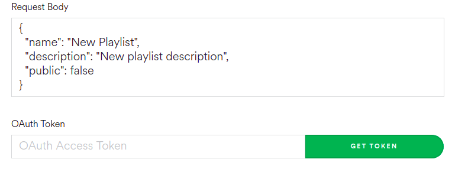
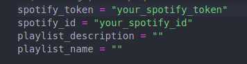
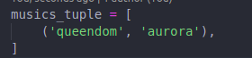

# About this project

The objective of this project is to facilitate the creation of playlists on spotify.

# Running this project

## Preparing the environment

To install the requirements run: 

```bash
    $ pip install -r requirements.txt
```

## Adding your data
* First, log into spotify and go to [web api spotify](https://developer.spotify.com/console/post-playlists/) , to get your `OAuth token` . 

    
* Then, go to `scripts/info.py` and add your user id and the token that you get on the last step.

    

* Now, you can put the songs that will be on the new playlist on the `musics.py`. Following the order `('music_name', 'artist')`

    

    * To every new music just add a new tuple on the file.

* To put the name on the playlist and also a description just add on the `info.py`.
  

## Executing the project

Just execute:

```
    $ python run.py
```